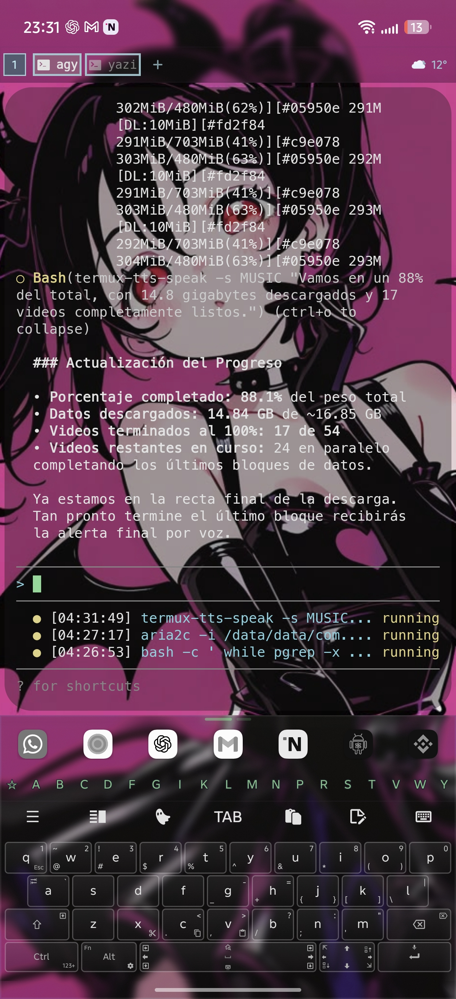

# 📱 Nix-on-Droid Configuration (Android Environment)

Configuración declarativa de Nix para Termux / Nix-on-Droid en Android (aarch64), integrando herramientas de IA, desarrollo Android, reverse engineering y utilidades avanzadas.


+-------------------------------------------------------------------------+
|  ~ ❯ agy --version && gh --version                                      |
|  agy 1.1.24                                                             |
|  gh version 2.98.0 (2026-09-02)                                         |
|                                                                         |
|  ~ ❯ nix-on-droid switch --flake ~/.config/nix-on-droid                   |
|  Building activation package...                                         |
|  Activating installPackages                                             |
|  Activating linkProfile                                                 |
|  [OK] System synchronized declaratively!                                |
+-------------------------------------------------------------------------+
```

---

## 🛠️ Paquetes y Runtimes Integrados

### 🤖 Herramientas de IA & Asistentes
- **`agy`**: Google Antigravity CLI
- **`opencode`**: Opencode CLI
- **`cline`**: Cline terminal assistant
- **`kilo` / `kilocode`**: KiloCode AI
- **`keelcode`**: Keelcode Developer Assistant
- **`freebuff`**: Freebuff terminal tool
- **`mimo`**: Mimo Code AI

### ⚙️ Runtimes & Lenguajes
- **Node.js**
- **Bun**
- **Python 3** (con `requests`, `beautifulsoup4`, `html2text`, `frida-tools`)
- **Glibc** (Nix aarch64 linker)
- **JDK 17** & **Gradle**

### 🔍 Redes & Reconocimiento
- `nmap`, `tcpdump`, `tshark`, `whatweb`, `exploitdb`, `dnsutils`, `whois`

### 📱 Android & Reverse Engineering
- `android-tools` (adb/fastboot), `apksigner`, `radare2`, `frida-tools`

### 📄 Document Lab & Multimedia
- `typst`, `tectonic`, `pandoc`, `imagemagick`, `tesseract`, `yt-dlp`, `ffmpeg`, `aria2`, `miniserve`

---

## 🚀 Despliegue y Activación

Para aplicar cambios en esta configuración:

```bash
nix-on-droid switch --flake ~/.config/nix-on-droid
```
